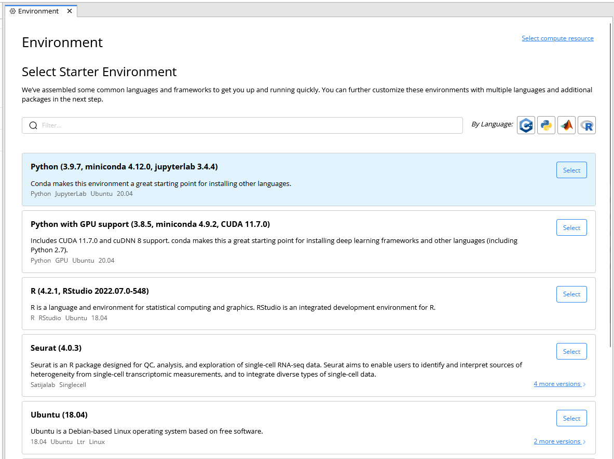
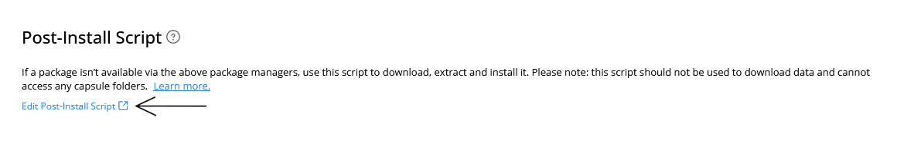
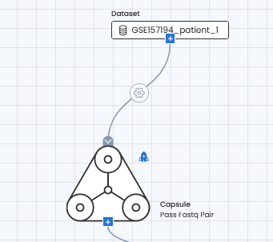
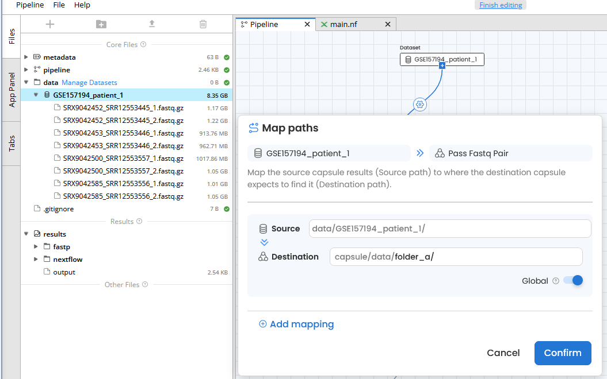
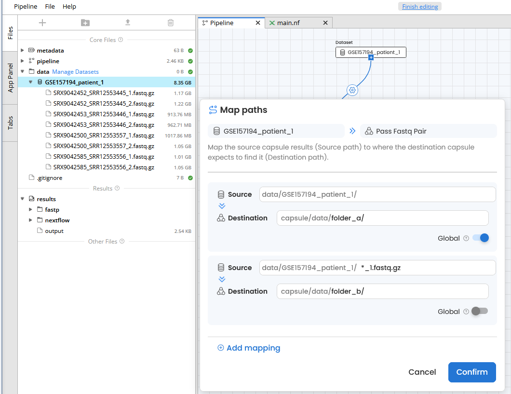
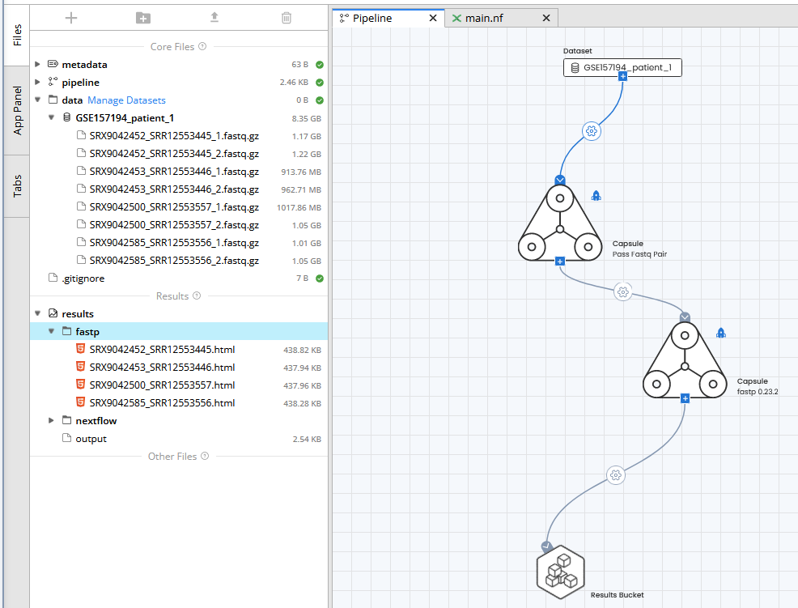

# Pass fastq pair


##### This capsule is intended to be used in the Code Ocean Pipelines UI when working with paired-end data.

<hr>

### Background

When working in Code Ocean pipelines, the dataflow from a dataset to a capsule is to either send one file at-a-time (default behavior) or send all the data (global toggle on) to the capsule. You would want to use the default behavior of sending one file at-a-time when working with sequencing data so that there is an instance of the capsule for every file. However, if you're working with paired-end reads files, the default behavior will separate forward and reverse reads files. This capsule solves this problem by passing 1 pair of paired-end reads files at-a-time wherever this capsule is used in a pipeline.

<hr>

### Setting up this capsule in *Code Ocean*

1. Create a new capsule and select **copy from public git**
    - 
2. Enter the url for this github repo
    - `https://github.com/OceanCodes/pass_fastq_pair.git`
3. Rename this capsule by clicking on **Untitled Capsule**. The name of this capsule should be **Pass Fastq Pair**.
4. Select a starter environment that has python available. The **Python (3.8.5, miniconda 4.9.2, jupyterlab 3.0.9)** starter environment that came preinstalled with *Code Ocean* will work.
    - 
5. Click on **Edit Post-Install Script**
    - 
6. Add the following code to the postinstall script

```
# install code ocean aux tools
git clone https://github.com/zappuf/aux_tools.git
cd aux_tools/
git checkout 7eb57d320eb77d6a9f0d3dca4345bd6f9bc20c49
chmod +x get_*
ln -s $PWD/get_*.py /usr/local/bin
```

7. Commit your changes by clicking on the green commit button in the top right.
8. Click on **Reproducible Run** to run this capsule using the sample data that was imported. You should end up with 1 complementary pair of paired-end reads files in the results folder.
    - The first time you run this capsule you will have a build log in the results folder. Every subsequent run will not have this build log unless you make a change to the environment. There is no need to change the environment.


<hr>


### Instructions for Using in a Pipeline

1. Add this capsule to your pipeline.
2. Connect this `Pass Fastq Pair` Capsule to the dataset.
3. Click on the gear icon in the connection between the dataset and this `Pass Fastq Pair` Capsule.
    - 
4. Add a folder to the **Destination** field and make sure to include the forward slash at the end of the folder name. In this example we use `folder_a/` as the folder.
    - 
5. Select **Global** for this particular mapping
6. Click on **Add mapping**
7. In the **Source** field of this new mapping, enter a pattern that will match either all the forward reads only or all the reverse reads only. In this example, our reads files end in either `_1.fastq.gz` or `_2.fastq.gz` so to match only the forward reads you will use `*_1.fastq.gz`
    - 
8. Enter a folder name in the **Destination** field. It does not matter what you name this folder as long as it's different from the folder name in the mapping above. In this example we used `folder_b/` as the folder name in this new mapping.
    - Note: Do not select Global in this new mapping. Your **Map paths** should look similar to our example above.




As you can see from the image of the pipeline example above, the pipeline accepted 8 total files that corresponded to 4 pairs of paired-end reads files and processed the pairs together. The output was 4 QC reports from the fastp capsule.
